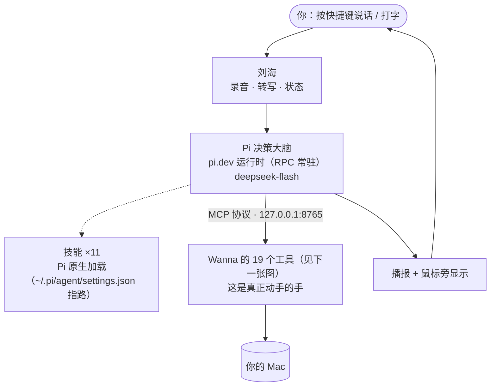

# 项目全貌

> **两张图看完。** 第一张：它怎么运转。第二张：那双"手"具体能做什么。
> 底下几个表是图上看不出来的补充（东西在哪、现在什么状态）。
>
> 这一篇是**给用户看的** —— 改任何功能都要同一次提交里更新它（`CLAUDE.md` §0.7）。

---

## 图 1 · 它怎么运转



**三个要点**（图上看不出来、但最要紧的）：

1. **决策在 Pi，"动手"在 Wanna。** Pi 是一个**常驻进程**（`pi --mode rpc`，
   Swift 通过 stdin/stdout 的 JSONL 跟它说话），它只**决定**；
   所有动作都由 Wanna 的 19 个 MCP 工具执行（pi 用第三方扩展 `pi-mcp-adapter` 接）。
2. **所以 Pi 不需要任何系统权限** —— 它跑在用户态，碰系统的全是 Wanna。
3. **没配好就如实报错，绝不静默退回。** 静默退回会制造一条假路：
   Pi 坏了悄悄换回旧的，屏幕上没有任何区别，**你以为在用新的，其实没有**。
4. **技能由 Pi 原生加载**（同一个 Agent Skills 规范：描述常驻、正文按需读）。
   位置在 `~/.pi/agent/settings.json` 的 `skills` 数组里指的绝对路径；
   4 个中文技能已按规范改名（graphics / computer-use / writing / retrospective，
   中文名挪进了 description）。
5. **对话记忆 = Wanna 会话 UUID → pi 的一个会话文件**
   （目录 `~/Library/Application Support/Wanna/pi-sessions/`，每个会话 UUID 一个 `.jsonl`）。
   **「连续对话」= 同一个 UUID；「新建对话」= 换一个。**
   历史与**上下文压缩**全归 pi（内置 compaction 默认开启），Swift 侧完全不管 ——
   之前那套「Swift 重放历史 / 历史压缩」已删（它们本来就是死代码或没人读）。
6. **每次任务的轨迹在诊断日志里**（`~/Library/Application Support/Wanna/主Agent诊断.log`，
   找 🥧 行）：起没起 Pi、哪段对话、几步、最终答了什么。
   ⚠️ `prompt` 成功 ≠ 跑完 —— 要等 `agent_settled`（官方规矩，runner 已照办）。

4. ⚠️ **只有一个 MCP：Wanna 自己那 19 个工具**（2026-09-29 删掉 firecrawl 之后）。
   联网搜索、读网页走 **AnySearch 技能** —— 它本来就覆盖同一件事，
   而且是**技能**（描述常驻约 130 字、正文按需读），
   firecrawl 却是 **27 个工具全量进上下文、46 604 字符**。
   **功能重复就只留一个，留成本低的那个。**

---

## 图 2 · 那双"手"能做什么（19 个动作）

```mermaid
flowchart LR
    subgraph LOOK["看"]
        T1["screenshot<br/>截图（不含 Wanna 自己）"]
        T2["read_screen<br/>读界面树，拿控件名和位置"]
    end
    subgraph ACT["动"]
        T3["click<br/>点击（可带控件名，比坐标准得多）"]
        T4["type_text<br/>打字"]
        T5["press_key<br/>按键 / 快捷键"]
        T6["scroll<br/>滚动"]
        T7["open_app<br/>打开应用"]
    end
    subgraph SHOW["<b>画给你看</b>（用户说这是刚需）"]
        T11["point<br/>蓝色光标飞过去指"]
        T12["draw<br/>圈出来 / 画箭头 / 连线"]
        T13["draw_figure<br/>画精确几何图（落成 SVG 打开）"]
    end
    subgraph KNOW["<b>查与读</b>"]
        T14["list_skills<br/>看有哪些"这类事怎么做"的方法论"]
        T15["read_file<br/>读文件（技能正文 / 任何文本）"]
        T16["write_file<br/>写文件"]
    end
    subgraph SPAWN["<b>派活</b>"]
        T17["spawn_agent<br/>派一个 Claude Code agent 干长活"]
        T18["send_agent<br/>给在跑的 agent 追加要求"]
    end
    subgraph FIX["兜底（普通点击点不动时用）"]
        T8["press_ax<br/>让目标 App 自己执行按下"]
        T9["set_value<br/>直接写值，绕过键盘"]
        T10["set_selected<br/>选中列表行（普通点击选不中）"]
    end
```

**每个动作做完会告诉你"界面变了什么"**：

```
点击了「显示起始页」。界面变了：新增 0 · 消失 1 · 改动 0。
⚠️ 界面没有任何变化 —— 这一下可能没点中，或者那个控件本来就不响应。
```

（在这之前只回一句「点击完成」，调用方不知道生效没有，于是会对着一个没发生的结果继续做。）

---

## 补充 · 图上看不出来的几件事

### Agent 有几个

| | |
|---|---|
| **主循环** | 图 1 里那个"决策大脑"所在的卡。你说的每句话都归它 |
| **Claude Code** | 兜底。主循环连续失败两次，活自动转给它 |
| **子 agent** | **一个都没有。** 原来三个（图形/执行/文本）已删，各自变成了技能 |

### 技能 ×11（教它"这类事怎么做"）

> **描述要短。** 官方规范（`skill-creator/SKILL.md`）对描述的要求是
> *"Keep discovery cheap and precise"* —— 因为它**常驻在提示词里**，写得越长占得越多，
> 而且罗列能力会**稀释区分度**（模型分不清该用哪个）。
> 2026-09-29 把 6 条过长的收了一遍：清单 **2 272 → 1 306 字符（−43%）**。
> 每条的正文一个字没动，只改了「什么时候用它」那一句。


| 技能 | 什么时候用 |
|---|---|
| 图形 | 指位置、圈出某处、画示意图、讲解屏幕上的题 |
| 执行 | 让电脑真的动起来：点击、打字、按快捷键、开 App、滚屏、读写文件、跑脚本 |
| 文本 | 文章、报告、翻译、销售/法律/财务/建筑类文案 |
| 复盘 | 问「为什么失败 / 上次怎么回事 / 复盘一下」 |
| anysearch | 联网搜索 |
| awesome-jev | 找 JEV 相关的 GitHub 项目 |
| cosyvoice-tts | 语音合成 |
| image-station | 图片生成编辑 |
| macos-fast-action | 全机操作路由 |
| notion | Notion 读写、双向同步 |
| search-max | 搜索总路由（自己不搜，只决定去哪搜） |

### 东西都在哪

| 东西 | 位置 |
|---|---|
| 技能 | `~/Documents/SuperAgent/APP/Design/wanna/skills/` |
| 复盘材料 | `<仓库>/Wanna复盘/` |
| 录音 / 转写 | `<仓库>/Wanna录音/` |
| 图形产出 | `<仓库>/Wanna图形/` |
| 诊断日志 | `~/Library/Application Support/Wanna/主Agent诊断.log` |
| Pi 决策大脑 | 官方运行时（npm 全局装 `@earendil-works/pi-coding-agent`）+ Wanna 侧的 `Wanna/PiAgentRunner.swift`；模型与会话配置在 `~/.pi/agent/` |

### ⚠️ 换 Python 之后**不会发生**的事（这一节最该看）

换决策大脑**不是零代价**。有两件事原来是靠"模型在回复里写标签"触发的，
而 Python 用的是 MCP 工具、**不写标签** —— 所以它们现在不触发了：

| 原来的能力 | 触发方式 | 现在 |
|---|---|---|
| **蓝光标飞过去指某个东西** | 原来靠回复里的 `[POINT:]` 标签 | ✅ **已补**：做成了 MCP 工具 `point`（用户说是刚需） |
| **在屏幕上画圈 / 画箭头标注** | 原来靠回复里的 `[SHAPE:]` 标签 | ✅ **已补**：做成了 MCP 工具 `draw`（用户说是刚需） |
| 你圈一块再问，模型知道该看哪 | 外壳把圈的区域塞进提示词 | ⚠️ 区域信息仍在提示词里；模型**不会**主动指位回应（要它指得明说） |
| 「参考屏幕」的多张截图 | 外壳收集后**当图片**传给模型 | ❌ **没传给 Python**（只传了文字）<br/>不过 Python **自己能调 `screenshot`** —— 要看得自己去看 |
| **画图**（几何图落成 SVG） | 原来靠 `[SVG_AGENT:]` 标签 | ✅ **已补**：`draw_figure` |
| **派 Claude Code agent 干活** | 原来靠 `[AGENT_SPAWN:]` 标签 | ✅ **已补**：`spawn_agent` / `send_agent` |
| **那 11 个技能** | 原来靠 `[SKILL:]` 标签拉正文 | ✅ **已补**，而且按官方规范分两级（见下） |
| **firecrawl（抓网页）** | 曾经接成官方 MCP | ❌ **已删**（2026-09-29）：与 AnySearch 技能功能重复。用户原话「它只是一个搜索工具，AnySearch 也能实现很好的功能和效果」 |
| **「命令」（搜索 / 读网页）** | 旧标签 `[RUN:]`，读 `tools/manifest.json` | ✅ **已删**（2026-09-29）：`ToolCatalog.swift` + `tools/manifest.json` + 提示词里那两段，全清了。功能由 firecrawl 覆盖 |
| Wanna 自己的 MCP 客户端 | 旧标签 `[MCP:…]` | ✅ **已删**（2026-09-29）：`MCPClient.swift`（295 行）+ `MCPServersStore.swift`（154 行）+ 提示词那一节。Python 直连 firecrawl 官方 MCP |
| **19 个标签的解析器本身** | `ActionTagParser` 里的正则 + `ActionParseResult` + CompanionManager 那个「解析→执行→继续」的循环 | ✅ **已删**（2026-09-29，用户拍板「删除吧」）：`ActionTagParser.swift` **1020 → 353 行**。判据是诊断日志不是推测 —— `🧩 解析：` 一次都没打过，`[CLICK:` / `[POINT:` / `[TYPE:` / `[SKILL:` / `[WAIT:` 在整个 1.3MB 日志里**各 0 次**。**只留 `[POINT:]`**：新装首次运行那段「光标飞过去指个东西」走的是旧视觉模型，它真的会写这个标签 |

**前两条已经找回来了**，办法是给它们各做一个 MCP 工具（走的是和原来**同一套**解析与绘制代码，
不是另写一遍）。实测：`draw` 画出的绿圈**在屏幕截图上肉眼可见**；`point` 日志与返回值都正常。

**还正常工作的**：录音 / 转写 / 播报 / 历史 / 刘海状态 / 方向看板 / 截图本身
—— 这些是外壳，不受影响。

### 现在什么状态

| | |
|---|---|
| Python 决策大脑 | ✅ 已接线跑通（实测 14 步 / 13 秒），**唯一的路** |
| 19 个工具 + "变了什么"报告 | ✅ 已上 |
| macos-use 从 Wanna 移出（留给 Claude） | ✅ 已执行 |
| 复盘 → 技能 | ✅ **已执行到底**（2026-09-29 补完）：概念、agent 记录、**两处「复盘」按钮**、那个没人调的函数，全部清掉。第一版只删了概念没删按钮，用户点着截图说「感觉你在自嗨，感觉检查了其实啥都没干」——**那次我验的是代码（grep 枚举），不是他要看的东西（界面）** |
| **Swift 的决策路径** | ✅ **已删**（连开关一起） |
| Swift 那 1430 行的**外壳部分** | ⚠️ 还在（状态机 / 播报 / 历史 / 刘海 / 截图）—— **Python 替不掉，不能删，也不需要重写** |
| Python 打包进 `.app` | ❌ 没做（现在指向仓库外的开发目录；**权限不受影响**，但换机器要重配） |
