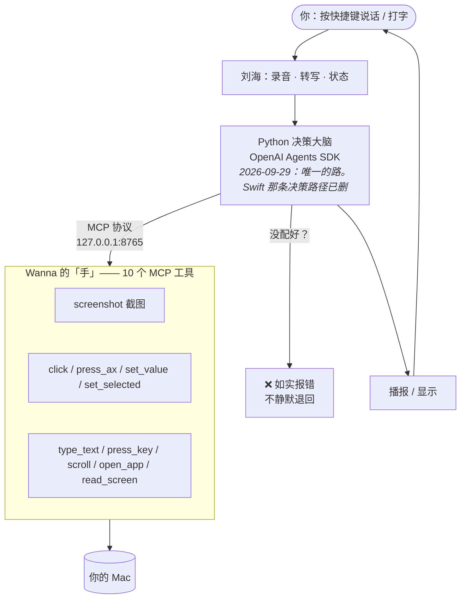
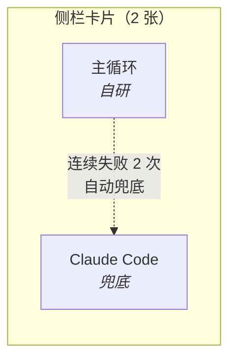
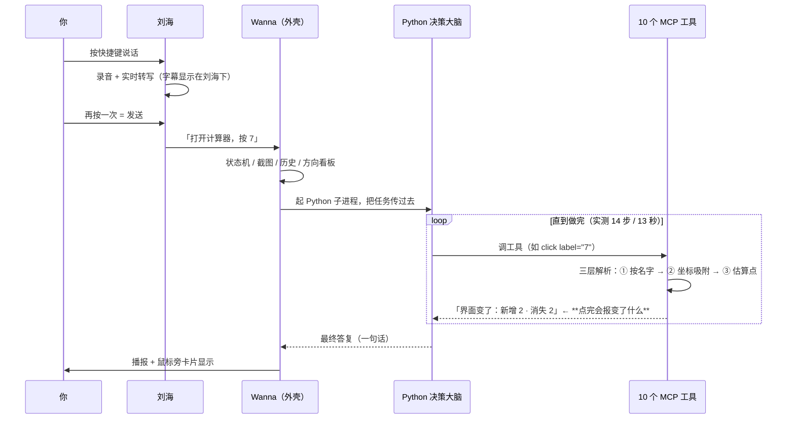
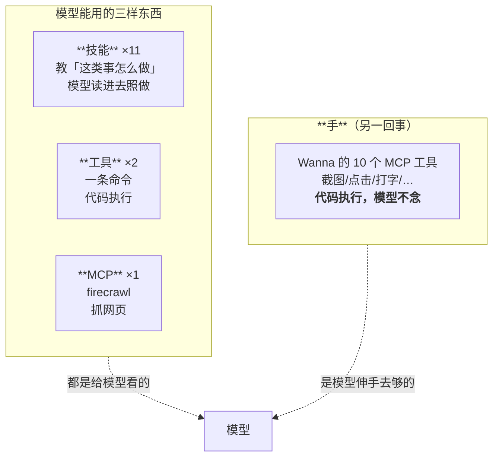
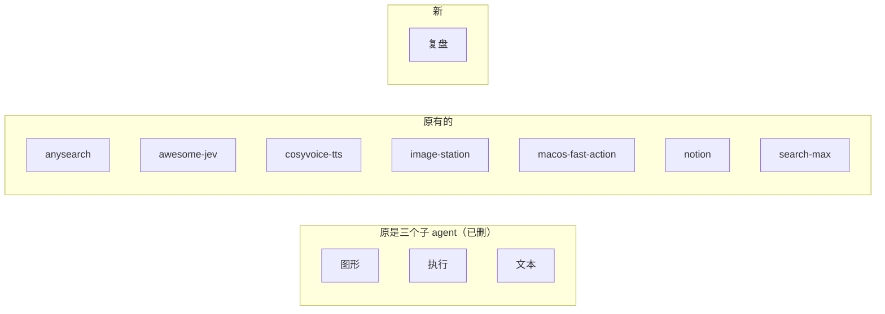
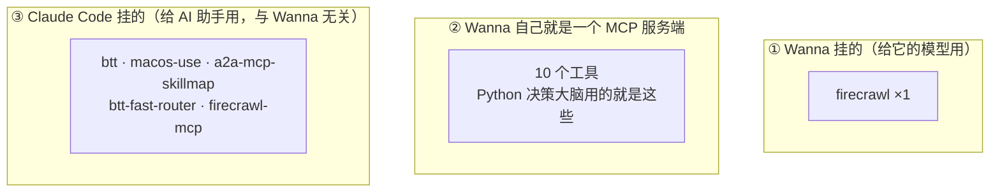

# 项目全貌 —— Agent · 工作逻辑 · 能力清单

> 写于 2026-09-29。**这一篇回答"这个项目现在长什么样"**，是给你（用户）看决策用的，
> 也是改任何东西之前该先读的那一篇。
>
> 与另外两处的分工：`需求/` 是**你要什么**；`开发经验/` 是**我们踩过什么坑**；
> 这一篇是**它现在是什么**。

---

## 〇、一句话

**你说一句话 → 一个决策大脑决定做什么 → 通过一双"手"去动电脑 → 结果回到你眼前。**

难的是这句话里的每一环都**各有各的层次**，下面一层层拆开。

---

## 一、整体形状



**两个要点**：

1. **决策和"手"是分开的** —— 决策在 Python，动手在 Wanna（Swift）。中间只有一条 MCP。
2. **Python 不需要任何系统权限** —— 所有碰系统的动作都是 Wanna 在做。所以 Python
   可以用任意解释器跑，不必打包进 App。

---

## 二、Agent 有几个

### 2.1 卡片 = Agent 主体（侧栏一张卡就是一个）

| 卡片 | 状态 | 干什么 |
|---|---|---|
| **主循环** | 自研，**就是上面那个"决策大脑"所在的卡** | 你说的每句话都归它 |
| **Claude Code** | 兜底 | 主循环连续失败两次，活自动转给它 |

> **复盘已经不是 agent 了**（2026-09-29 按你的要求改成技能，见第五节）。



### 2.2 子 agent —— **一个都没有**

原来有三个（图形 / 执行 / 文本），2026-09-28 全部删除，**各自变成一个技能**。
`[AGENT:谁:任务]` 那套派活已经不存在，解析器也没有了。

**为什么删**：那是"两级模型接力"（第二个模型、第二份提示词、第二轮请求），
实测六轮从来没稳定跑通过，断点每次还不一样。

---

## 三、一轮的完整工作逻辑



### 三个关键机制

**① 三层解析是串行兜底，不是并行对比**

```
① 按名字  → 找到就返回（代码原话：根本不看估算点）
          → 没找到 ↓
② 坐标吸附（拿估算点当线索找附近的小控件）
          → 没找到 ↓
③ 直接用估算点   ← 实测命中率约 17%
```

⚠️ **③ 不是罕见路径**：仓库自己量过，7 次点击解析里 **6 次是「模型没写名字」** → 直接掉到 ③。

**耗时**：纯代码，**不是三次模型交互**。模型只被调一次；①② 各要一次 AX 跨进程
查询（实测 0.14–0.6 秒）。最坏多花一秒左右。

**② 点完会告诉你"界面变了什么"** —— 这是 2026-09-29 从 `mcp-server-macos-use`
移植过来的，也是最值钱的一件：

```
点击了「显示起始页」。界面变了：新增 0 · 消失 1 · 改动 0。
⚠️ 界面没有任何变化 —— 这一下可能没点中，或者那个控件本来就不响应。
```

在这之前只回一句「点击完成」，**调用方不知道生效没有**，于是会对着一个没发生的结果继续做。

**③ 没写名字的点击不许静默执行** —— 做不到就如实说，不假装成功。

---

## 四、能力来源：三样东西，别混



**一句话区分**：

| | 是什么 | 谁执行 |
|---|---|---|
| **技能** | 一段方法论（"这类事怎么做"） | **模型自己照做** |
| **工具 / MCP** | 一条命令、一个外部服务 | **代码执行** |
| **那 10 个工具** | 真正动手的手 | **Wanna 执行** |

---

## 五、技能 ×11

**常驻提示词里只放每个技能的一句描述**，正文按需 `[SKILL:名字]` 拉进**这一轮**。



| 技能 | 什么时候用 |
|---|---|
| **图形** | 指位置、圈出某处、画示意图、讲解屏幕上的题 |
| **执行** | 点击、打字、按快捷键、开 App、滚屏、读写文件、跑脚本、联网 |
| **文本** | 文章、报告、翻译、销售/法律/财务/建筑类文案 |
| **复盘** | 问「为什么会失败 / 上次怎么回事 / 复盘一下」时（2026-09-29 新增） |
| anysearch | 联网搜索 |
| awesome-jev | 找 JEV 相关的 GitHub 项目 |
| cosyvoice-tts | 语音合成（阿里 CosyVoice） |
| image-station | 图片生成编辑（本机 New API 的 gpt-image-2.5） |
| macos-fast-action | 全机操作路由（索引直接执行，没命中走 BTT 37 条） |
| notion | Notion 读写、双向同步 |
| search-max | 搜索总路由（自己不搜，只决定去哪搜） |

**位置**：`~/Documents/SuperAgent/APP/Design/wanna/skills/<名字>/SKILL.md`
（**在仓库外** —— 用户要能自己往里加）。

**复盘技能的实质**是一条容易搞混的区分：

| 文件 | 记什么 | 谁写 |
|---|---|---|
| `Wanna复盘/执行历史.md` | **发生过什么**（原料） | Wanna 自己 |
| `Wanna复盘/复盘报告.md` | **上一轮的结论** | 复盘任务 |

---

## 六、工具目录 ×2

**位置**：`~/Documents/SuperAgent/APP/Design/wanna/tools/manifest.json`（同样在仓库外）

| 工具 | 干什么 |
|---|---|
| 搜索 | 联网查东西（唯一能上外网搜的） |
| 读网页 | 给一个 URL，把正文读出来 |

模型用 `[RUN:工具名:参数]` 调。**不走 shell** —— `argv` 是数组，参数里的
`;`、`` ` ``、`$(...)`、换行都不会变成命令。**模型只能挑目录里有的，不能自己造命令。**

---

## 七、MCP —— 三个层面，必须分清



> ⚠️ 你 2026-09-29 要求：**macos-use 从 Wanna 摘掉、留给 Claude** —— 已执行。
> Wanna 现在只挂 firecrawl 一个。

### Wanna 的 10 个 MCP 工具（那双"手"）

| 工具 | 干什么 | 备注 |
|---|---|---|
| `screenshot` | 截图 | **自动剔除 Wanna 自己的窗口**；返回 0–1000 归一化网格 |
| `click` | 点击 | 参数带 `label`（控件原文名）+ `targeting`(auto/by_name/by_coordinate) |
| `press_ax` | 无障碍"按下" | 合成点击被吞时用（Catalyst / 沙箱应用） |
| `set_value` | 直接写值 | 绕过键盘（沙箱输入框、安全输入框） |
| `set_selected` | 选中列表行 | 普通点击**选不中**，只有它能 |
| `type_text` | 打字 | |
| `press_key` | 按键 | 可带修饰键 |
| `scroll` | 滚动 | |
| `open_app` | 打开应用 | **名字要用 bundle id** |
| `read_screen` | 读界面树 | 返回的坐标**就是** 0–1000 网格 |

**鉴权**：只绑 `127.0.0.1` + token（`~/Library/Application Support/Wanna/mcp-token`，0600）。

---

## 八、关键位置（你要找东西时）

| 东西 | 在哪 |
|---|---|
| **技能** | `~/Documents/SuperAgent/APP/Design/wanna/skills/` |
| **工具目录** | `~/Documents/SuperAgent/APP/Design/wanna/tools/manifest.json` |
| **MCP 配置**（Wanna 的） | `~/Library/Application Support/Wanna/MCPServers.json` |
| **MCP 令牌** | `~/Library/Application Support/Wanna/mcp-token` |
| **复盘材料** | `<仓库>/Wanna复盘/` |
| **录音 / 转写** | `<仓库>/Wanna录音/` |
| **图形产出** | `<仓库>/Wanna图形/` |
| **诊断日志** | `~/Library/Application Support/Wanna/主Agent诊断.log` |
| **Python 决策大脑** | `~/Documents/SuperAgent/WannaAgent/wanna_agent.py` |

---

## 九、现在的状态：哪些是新的、哪些还没动

| | 状态 |
|---|---|
| Python 决策大脑（OpenAI Agents SDK） | ✅ **已接线并跑通**（实测 14 步 / 13 秒） |
| Wanna 的 10 个 MCP 工具 | ✅ 已暴露，含 diff 报告 |
| macos-use 从 Wanna 移出 | ✅ 已执行 |
| 复盘 → 技能 | ✅ 已执行 |
| **静默退回**（没配好就偷偷换回 Swift） | ✅ **已删**（2026-09-29）—— 它制造假路，坏了要大声说 |
| **Swift 的决策路径** | ✅ **已删**（2026-09-29）—— 连那个开关一起。Swift 那边现在只剩**外壳** |
| **主循环那 1430 行**（外壳部分） | ⚠️ **还在** —— 状态机 / 播报 / 历史 / 刘海 / 截图。**Python 替不掉，不能删** |
| 复盘的两道旧权限闸门 | ⚠️ 恒为假，**留着没删** |
| Python 打包进 `.app` | ❌ 没做（现在指向仓库外的开发目录；**权限不受影响**，但换机器要重配） |

### 一句话说清"换框架"换到哪了

> **决策换完了，外壳没动。** 你按快捷键说话，**拍板的是 Python 了**；
> 但状态机、播报、历史、刘海这些还是 Swift 在管 —— 它们**不是决策**，
> 所以不在"换成 agent 框架"的范围里。
>
> 而且按 §「极简优先」的原则：**外壳不需要重写**。它现在能正常工作，
> 重写它属于"增加无限的修改"，是用户明确反对的。

---

## 十、你可能想改的几个地方（供你说方案时参考）

1. **删掉那 1430 行 Swift 决策循环** —— 它现在只剩外壳职责，可以进一步瘦身
2. **Python 打包进 `.app`** —— 为了让它在任何机器上都能跑，不必先配环境
3. **技能想加/想改** —— 直接改 `skills/` 下的文件夹，**代码一行不用动**
4. **想让它能做的事更多** —— 加"工具"（`manifest.json`）比加技能更重，但能跑命令
