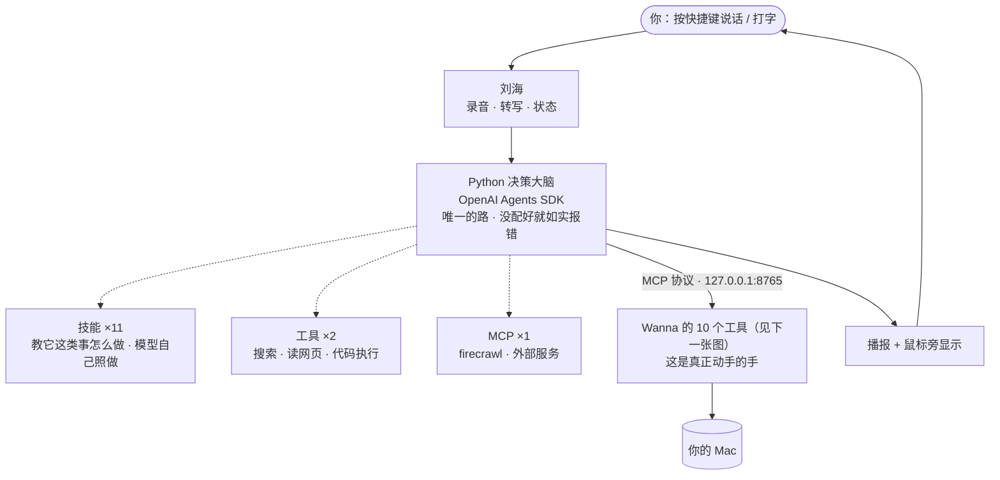
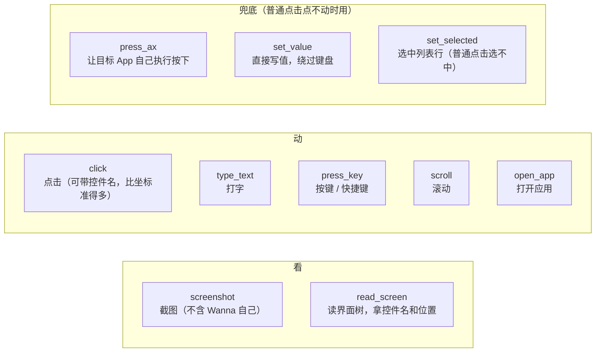

# 项目全貌

> **两张图看完。** 第一张：它怎么运转。第二张：那双"手"具体能做什么。
> 底下几个表是图上看不出来的补充（东西在哪、现在什么状态）。
>
> 这一篇是**给用户看的** —— 改任何功能都要同一次提交里更新它（`CLAUDE.md` §0.7）。

---

## 图 1 · 它怎么运转



**三个要点**（图上看不出来、但最要紧的）：

1. **决策在 Python，"动手"在 Wanna。** 中间只有一条 MCP ——
   Python 不碰你的电脑，它只是**决定**；所有动作都由 Wanna 执行。
2. **所以 Python 不需要任何系统权限** —— 这也是它能用任意解释器跑、
   不必打包进 App 的原因。
3. **没配好就如实报错，绝不静默退回。** 静默退回会制造一条假路：
   Python 坏了悄悄换回旧的，屏幕上没有任何区别，**你以为在用新的，其实没有**。

---

## 图 2 · 那双"手"能做什么（10 个工具）



**每个动作做完会告诉你"界面变了什么"**：

```
点击了「显示起始页」。界面变了：新增 0 · 消失 1 · 改动 0。
⚠️ 界面没有任何变化 —— 这一下可能没点中，或者那个控件本来就不响应。
```

（在这之前只回一句「点击完成」，调用方不知道生效没有，于是会对着一个没发生的结果继续做。）

---

## 补充 · 图上看不出来的几件事

### Agent 有几个

| | |
|---|---|
| **主循环** | 图 1 里那个"决策大脑"所在的卡。你说的每句话都归它 |
| **Claude Code** | 兜底。主循环连续失败两次，活自动转给它 |
| **子 agent** | **一个都没有。** 原来三个（图形/执行/文本）已删，各自变成了技能 |

### 技能 ×11（教它"这类事怎么做"）

| 技能 | 什么时候用 |
|---|---|
| 图形 | 指位置、圈出某处、画示意图、讲解屏幕上的题 |
| 执行 | 点击、打字、按快捷键、开 App、滚屏、读写文件、跑脚本、联网 |
| 文本 | 文章、报告、翻译、销售/法律/财务/建筑类文案 |
| 复盘 | 问「为什么失败 / 上次怎么回事 / 复盘一下」 |
| anysearch | 联网搜索 |
| awesome-jev | 找 JEV 相关的 GitHub 项目 |
| cosyvoice-tts | 语音合成 |
| image-station | 图片生成编辑 |
| macos-fast-action | 全机操作路由 |
| notion | Notion 读写、双向同步 |
| search-max | 搜索总路由（自己不搜，只决定去哪搜） |

### 东西都在哪

| 东西 | 位置 |
|---|---|
| 技能 | `~/Documents/SuperAgent/APP/Design/wanna/skills/` |
| 工具目录 | `~/Documents/SuperAgent/APP/Design/wanna/tools/manifest.json` |
| MCP 配置（Wanna 的） | `~/Library/Application Support/Wanna/MCPServers.json` |
| 复盘材料 | `<仓库>/Wanna复盘/` |
| 录音 / 转写 | `<仓库>/Wanna录音/` |
| 图形产出 | `<仓库>/Wanna图形/` |
| 诊断日志 | `~/Library/Application Support/Wanna/主Agent诊断.log` |
| Python 决策大脑 | `~/Documents/SuperAgent/WannaAgent/wanna_agent.py` |

### 现在什么状态

| | |
|---|---|
| Python 决策大脑 | ✅ 已接线跑通（实测 14 步 / 13 秒），**唯一的路** |
| 10 个工具 + "变了什么"报告 | ✅ 已上 |
| macos-use 从 Wanna 移出（留给 Claude） | ✅ 已执行 |
| 复盘 → 技能 | ✅ 已执行 |
| **Swift 的决策路径** | ✅ **已删**（连开关一起） |
| Swift 那 1430 行的**外壳部分** | ⚠️ 还在（状态机 / 播报 / 历史 / 刘海 / 截图）—— **Python 替不掉，不能删，也不需要重写** |
| Python 打包进 `.app` | ❌ 没做（现在指向仓库外的开发目录；**权限不受影响**，但换机器要重配） |
