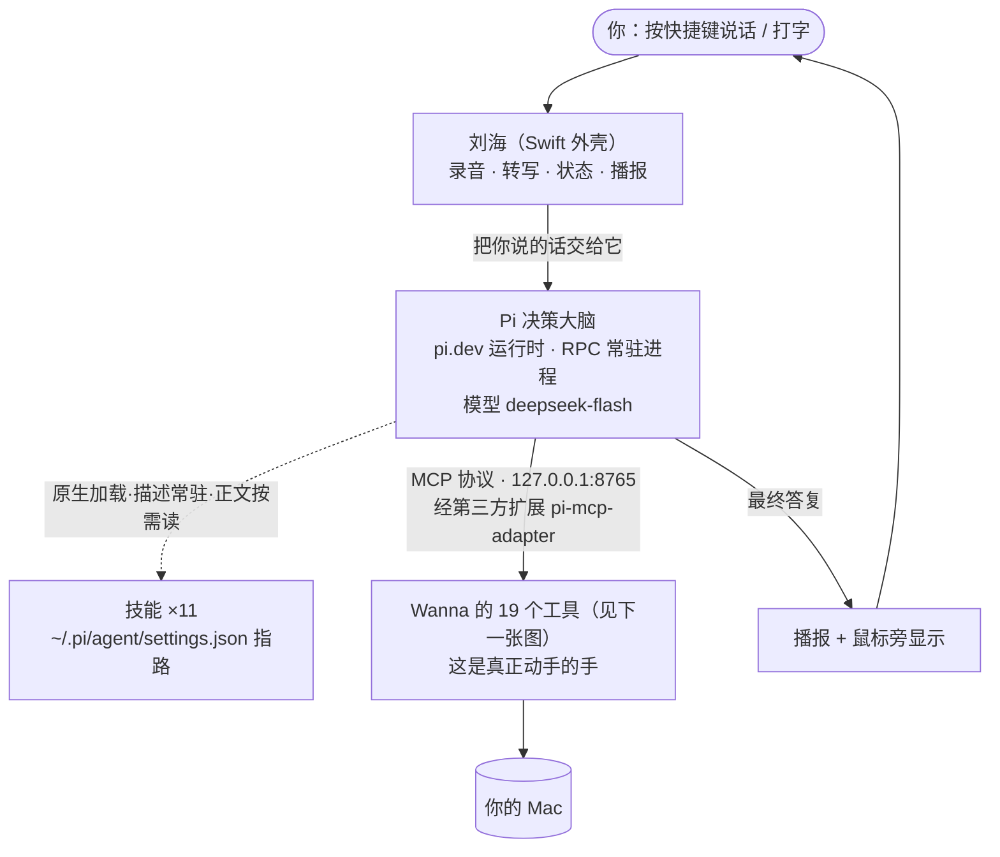

# 项目全貌

> **两张图看完。** 第一张：它怎么运转。第二张：那双"手"具体能做什么。
> 底下几个表是图上看不出来的补充（东西在哪、哪些能力怎么来的、现在什么状态）。
>
> 这一篇是**给用户看的** —— 改任何功能都要同一次提交里更新它（`CLAUDE.md` §0.7）。
> （2026-09-29 换血之后整体重写：决策大脑 = Pi，OpenAI Agents SDK 那条 Python 链已整条删除。）

---

## 图 1 · 它怎么运转



**六个要点**（图上看不出来、但最要紧的）：

1. **决策在 Pi，"动手"在 Wanna。** Pi 是一个**常驻进程**（`pi --mode rpc`，
   Wanna 里的 `PiAgentRunner.swift` 通过 stdin/stdout 的 JSONL 跟它说话），它只**决定**；
   所有动作都由 Wanna 的 19 个 MCP 工具执行。
2. **所以 Pi 不需要任何系统权限** —— 它跑在用户态，碰系统（截屏 / 点击 / 麦克风）的全是 Wanna。
3. **没配好就如实报错，绝不静默退回。** 静默退回会制造一条假路：
   Pi 坏了悄悄换回别的，屏幕上没有任何区别，**你以为在用新的，其实没有**。
4. **技能由 Pi 原生加载**（同一个 Agent Skills 规范：描述常驻在提示词里，正文用到才读）。
   位置在 `~/.pi/agent/settings.json` 的 `skills` 数组里用**绝对路径**指过去 —— 不用挪目录。
   4 个中文技能已按规范改名（graphics / computer-use / writing / retrospective，中文名挪进了 description）。
5. **对话记忆 = Wanna 会话 UUID → pi 的一个会话文件**
   （目录 `~/Library/Application Support/Wanna/pi-sessions/`，每个会话 UUID 一个 `.jsonl`）。
   **「连续对话」= 同一个 UUID；「新建对话」= 换一个。**
   历史与**上下文压缩**全归 pi（内置 compaction 默认开启），Swift 侧完全不管。
6. **每次任务的轨迹在诊断日志里**（`~/Library/Application Support/Wanna/主Agent诊断.log`，
   找 🥧 行）：起没起 Pi、哪段对话、几步、最终答了什么。
   ⚠️ 官方规矩：`prompt` 成功 ≠ 跑完 —— 要等 `agent_settled`（runner 已照办）。

**为什么只有一个 MCP**：联网搜索、读网页走 **AnySearch 技能**。
曾经接过的 firecrawl MCP（27 个工具、46 604 字符进上下文）与它功能重复，已删 ——
**功能重复就只留一个，留成本低的那个。**

---

## 图 2 · 那双"手"能做什么（19 个动作）

```mermaid
flowchart LR
    subgraph LOOK["看"]
        T1["screenshot<br/>截图（不含 Wanna 自己）"]
        T2["read_screen<br/>读界面树，拿控件名和位置"]
    end
    subgraph ACT["动"]
        T3["click<br/>点击（可带控件名，比坐标准得多）"]
        T4["type_text<br/>打字"]
        T5["press_key<br/>按键 / 快捷键"]
        T6["scroll<br/>滚动"]
        T7["open_app<br/>打开应用"]
    end
    subgraph SHOW["<b>画给你看</b>（用户说这是刚需）"]
        T11["point<br/>蓝色光标飞过去指"]
        T12["draw<br/>圈出来 / 画箭头 / 连线"]
        T13["draw_figure<br/>画精确几何图（落成 SVG 打开）"]
    end
    subgraph KNOW["<b>查与读</b>"]
        T14["list_skills<br/>看有哪些"这类事怎么做"的方法论"]
        T15["read_file<br/>读文件（技能正文 / 任何文本）"]
        T16["write_file<br/>写文件"]
        T19["search_history<br/>在完整对话历史里翻找<br/>（默认只带最近几轮，更早的自己翻）"]
    end
    subgraph SPAWN["<b>派活</b>"]
        T17["spawn_agent<br/>派一个 Claude Code agent 干长活"]
        T18["send_agent<br/>给在跑的 agent 追加要求"]
    end
    subgraph FIX["兜底（普通点击点不动时用）"]
        T8["press_ax<br/>让目标 App 自己执行按下"]
        T9["set_value<br/>直接写值，绕过键盘"]
        T10["set_selected<br/>选中列表行（普通点击选不中）"]
    end
```

**每个动作做完会告诉你"界面变了什么"**：

```
点击了「显示起始页」。界面变了：新增 0 · 消失 1 · 改动 0。
⚠️ 界面没有任何变化 —— 这一下可能没点中，或者那个控件本来就不响应。
```

（在这之前只回一句「点击完成」，调用方不知道生效没有，于是会对着一个没发生的结果继续做。）

---

## 补充 · 图上看不出来的几件事

### Agent 有几个

| | |
|---|---|
| **主循环** | 图 1 里那个"决策大脑"所在的卡。你说的每句话都归它 |
| **Claude Code** | 兜底。主循环连续失败两次，活自动转给它 |
| **子 agent** | **一个都没有。** 原来三个（图形/执行/文本）已删，各自变成了技能。（Pi 核心同样不带子 agent；社区有 `pi-subagents` 扩展，需要再装 —— 符合"没有内置功能，要就装插件"） |

### 技能 ×11（教它"这类事怎么做"，Pi 原生加载）

> **描述要短。** 官方规范对描述的要求是 *"Keep discovery cheap and precise"* ——
> 因为它**常驻在提示词里**，写得越长占得越多，罗列能力还会**稀释区分度**。
> 2026-09-29 把 6 条过长的收过一遍（清单 2 272 → 1 306 字符，−43%）；
> 4 个中文名按 Pi 的规范改成了小写英文（规范只认小写字母/数字/连字符，
> **名字不合规的技能静默不加载**）。正文一个字没动。

| 技能 | 什么时候用 |
|---|---|
| graphics（原「图形」） | 指位置、圈出某处、画示意图、讲解屏幕上的题 |
| computer-use（原「执行」） | 让电脑真的动起来：点击、打字、按快捷键、开 App、滚屏、读写文件、跑脚本 |
| writing（原「文本」） | 文章、报告、翻译、销售/法律/财务/建筑类文案 |
| retrospective（原「复盘」） | 问「为什么失败 / 上次怎么回事 / 复盘一下」 |
| anysearch | 联网搜索 |
| awesome-jev | 找 JEV 相关的 GitHub 项目 |
| cosyvoice-tts | 语音合成 |
| image-station | 图片生成编辑 |
| macos-fast-action | 全机操作路由 |
| notion | Notion 读写、双向同步 |
| search-max | 搜索总路由（自己不搜，只决定去哪搜） |

### 东西都在哪

| 东西 | 位置 |
|---|---|
| 技能 | `~/Documents/SuperAgent/APP/Design/wanna/skills/`（Pi 用绝对路径指到这里） |
| Pi 的模型与会话配置 | `~/.pi/agent/`（`models.json` 接 DeepSeek、`settings.json` 指技能、`auth.json`） |
| pi 的 MCP 扩展 | `pi-mcp-adapter`（npm 安装）；服务器配置在 `~/.config/mcp/mcp.json`（token 走 `!命令`，不落明文） |
| pi 的会话文件（记忆） | `~/Library/Application Support/Wanna/pi-sessions/` |
| 复盘材料 | `<仓库>/Wanna复盘/` |
| 录音 / 转写 | `<仓库>/Wanna录音/` |
| 图形产出 | `<仓库>/Wanna图形/` |
| 诊断日志 | `~/Library/Application Support/Wanna/主Agent诊断.log`（找 🥧 行 = Pi 轨迹） |
| Pi 决策大脑的 Swift 侧 | `<仓库>/Wanna/PiAgentRunner.swift` |
| 官方文档本地副本 | `<仓库>/reference/pi/`（38 份核心文档 + 全览导读 `全局框架/Pi全览.md`） |

### 现在的能力是怎么来的（换血一览）

早期版本里模型靠在回复里**写标签**（`[CLICK:]` / `[POINT:]` / `[SKILL:]`…）让外壳执行动作。
换到 agent 框架后模型直接调工具，标签那套整条删了 —— 每个能力要么做成了工具，要么由 Pi 原生接管：

| 能力 | 现在 |
|---|---|
| **蓝光标飞过去指某个东西** | ✅ MCP 工具 `point`（用户说是刚需） |
| **在屏幕上画圈 / 画箭头标注** | ✅ MCP 工具 `draw`（用户说是刚需） |
| **画图**（几何图落成 SVG） | ✅ MCP 工具 `draw_figure` |
| **派 Claude Code agent 干活** | ✅ MCP 工具 `spawn_agent` / `send_agent` |
| **11 个技能** | ✅ Pi 原生三级披露（描述常驻、正文按需读），格式与之前完全一致 |
| **对话记忆 + 上下文压缩** | ✅ Pi 原生（会话树 + 内置 compaction）—— 之前 Swift 侧那套（重放/压缩）已删 |
| **更早的历史翻查** | ✅ MCP 工具 `search_history`（默认只带最近几轮，更早的模型自己翻） |
| 你圈一块再问，模型知道该看哪 | ⚠️ 区域信息仍在提示词里；模型**不会**主动指位回应（要它指得明说） |
| 「参考屏幕」的多张截图 | ⚠️ 外壳只传文字；模型**自己能调 `screenshot`** —— 要看得自己去看 |
| 联网搜索 / 读网页 | ✅ AnySearch **技能**（firecrawl MCP 因功能重复已删） |
| 旧标签解析器（19 个标签） | ✅ **已删**（`ActionTagParser` 1020 → 353 行，只留开机引导用的 `[POINT:]`）。判据是诊断日志：那些标签在整个 1.3MB 日志里各 0 次 |
| 旧「命令」目录 / 自制 MCP 客户端 | ✅ **已删**（`ToolCatalog` / `MCPClient` / `MCPServersStore`）—— 功能由技能与官方机制覆盖 |

### 现在什么状态

| | |
|---|---|
| **Pi 决策大脑（RPC 常驻）** | ✅ 已跑通并端到端实测：问答 1.9 秒、「打开计算器」1 步真开、进程常驻不重起、会话切回记忆还在 |
| **19 个工具 + "变了什么"报告** | ✅ 已上 |
| **换机器要装什么** | npm 全局 `@earendil-works/pi-coding-agent` + `pi install npm:pi-mcp-adapter` + `~/.pi/agent/`（models.json / settings.json）+ `~/.config/mcp/mcp.json`；Wanna 本体照常 |
| **Swift 的外壳** | ✅ 全部保留（刘海 / 录音 / 播报 / 截图 / 光标 / 看板）—— Pi 替不掉，也不该替 |
| **Swift 里的 agent 框架逻辑** | ✅ 已删干净（决策循环 / 重放历史 / 历史压缩 / 旧标签解析 / Python 链） |
| macos-use 从 Wanna 移出（留给 Claude） | ✅ 已执行 |
| 复盘 → 技能 | ✅ 已执行到底（概念、agent 记录、两处按钮全清） |

### ⚠️ 已知的小坑（都有官方依据，详见 `全局框架/Pi全览.md` 与 `官方依据.md`）

- **技能名不合规 = 静默不加载**（规范要小写字母/数字/连字符）—— 加新技能必须用英文小写名。
- **Pi 会自动发现 `~/.agents/skills/`** 里别的工具装的技能（bailian-* 等），每轮进系统提示词；
  没动它们，要省上下文得单独处理。
- **print 模式（`-p`）+ 技能声明 = 无 TTY 挂死** —— 脚本调用走 RPC，别用 `-p`。
- **仓库的 AGENTS.md 有 503KB**，Pi 会自动读 CLAUDE.md/AGENTS.md —— 所以 runner 启动 Pi 时
  一定带 `--no-context-files`（关掉它，技能照常加载）。
